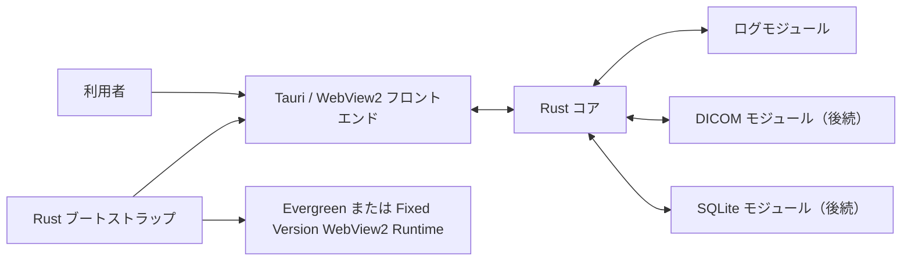

# アーキテクチャ概要

- 状態: 採用済み（Accepted）
- 管理責任者: リポジトリメンテナー
- 最終更新日: 2026-08-24
- 要件の基準: Hakutaku 初期仕様 版 1.10

## 目的

本書は Hakutaku の実装境界、技術選定条件、配布経路、技術検証の段階を定義します。

Rust + Tauri 2系は確定技術ではなく暫定採用です。段階0の完了では確定せず、段階1の Windows 10 IoT Enterprise LTSC 実機検証が完了した時点で確定または再選定します（`TECH-003`、`VER-001`）。この判断は [ADR-0001](decisions/0001-rust-tauri-provisional-adoption.md)（`DEC-002` 対応、暫定決定）に記録済みで、確定は段階1（P13）の完了時です。

## アーキテクチャドライバー

- 大容量・多数のログを段階的かつキャンセル可能に読み、UI の応答性を保つ（`PERF-*`）。
- 運用先の対象端末で稼働する他の業務ソフトウェアと同時に動作し、そのソフトウェアへの影響を Hakutaku の処理速度より優先する（`ENV-010`、`ENV-011`）。
- ログ・DICOM・SQLite の固有情報と元データを保ち、形式別の失敗を隔離する（`ERR-*`）。
- 新形式を内部モジュールとして追加できる一方、第三者向け外部プラグインは持たない（`EXT-*`）。
- オフラインで起動し、Evergreen と Fixed Version の WebView2 Runtime の両経路を保守する（`DIST-*`）。
- Rust コアのヒープ会計と WebView2 側の保持上限を分け、両プロセス領域のメモリ増加を制御する（`TECH-006`、`PERF-008`、`PERF-012`）。
- 参照内容をネットワークへ送信せず、フロントエンドへ任意パスのファイルアクセス権を与えない（`SEC-001`、`SEC-011`、`SEC-012`）。

## 内部拡張方式の確定要件

| ID | 要件 |
| --- | --- |
| EXT-001 | 新しい非テキスト形式を将来追加でき、画面を切り替えて閲覧できる設計とする。 |
| EXT-002 | 新形式はソースコード上の内部モジュールとして追加し、Hakutaku を再ビルドして提供できればよい。 |
| EXT-003 | 第三者向けの DLL などを使った外部プラグイン機構は設けない。 |

## 技術選定の確定要件

| ID | 要件 |
| --- | --- |
| TECH-001 | 技術選定では高速性を重視する。 |
| TECH-002 | Python は実行速度と配布の懸念から第一候補にしない。 |
| TECH-003 | 初期技術スタックとして、実装言語に Rust、GUI フレームワークに Tauri 2系を暫定採用する。技術試作が要件を満たさない場合は再選定できる。`Q-028` はこの方針で解決済みとする。 |
| TECH-004 | Tauri のアプリ・ビルド設定および Capability 定義には TOML を使用し、Hakutaku の利用者向け設定は `hakutaku.yaml` とする。Hakutaku の設定ファイルとして JSON を採用しない。 |
| TECH-005 | Tauri を初期化する前に Rust 側のブートストラップ処理で WebView2 Runtime の有無を確認する。Runtime が見つからない場合の通知には Tauri を使用せず、Windows のネイティブダイアログを使用する。 |
| TECH-006 | Tauri のヒープ会計は Rust コアプロセスのグローバルアロケータを計装して行い、`PERF-008` の対象を Rust プロセス内の全確保とする。フロントエンド側は `PERF-012` の保持上限で制御する。 |

## 配布の確定要件

| ID | 要件 |
| --- | --- |
| DIST-001 | インストーラーは使用しない。 |
| DIST-002 | 実現が容易で、実行ファイルが過度に巨大化しない場合は単一 EXE を採用する。 |
| DIST-003 | 単一 EXE のサイズは、おおむね 100 MB 以下を目標とする。 |
| DIST-004 | 単一 EXE 化が難しい場合は、必要ファイルを含むフォルダ一式を ZIP で配布し、展開して実行できるようにする。 |
| DIST-005 | 配布物一式（本体 ZIP、および必要な環境向けの WebView2 Runtime 追加パッケージ）だけで、実行時にネットワークからの取得を行わずに起動できること。オフライン環境での自動ダウンロードを前提としない。 |
| DIST-006 | 起動時は、互換性のあるOS導入済みのEvergreen WebView2 Runtimeを最初に使用し、見つからない場合は実行ファイル直下の `WebView2Runtime` フォルダに配置されたFixed Version Runtimeを使用する。 |
| DIST-007 | Fixed Version RuntimeはHakutaku本体へ常時同梱せず、必要な環境向けの任意追加パッケージとして別のZIPで提供できること。追加パッケージのサイズは `DIST-003` のHakutaku本体サイズ目標に含めない。 |
| DIST-008 | ローカルのFixed Version Runtimeはインストーラー、レジストリ登録、システムフォルダへの配置を必要としない。実行ファイルからの相対位置（実行ファイル直下の `WebView2Runtime`）に配置したRuntimeを、Hakutakuのプロセス内で `WEBVIEW2_BROWSER_EXECUTABLE_FOLDER` 相当へ実行時に解決した絶対パスとして設定し、使用する。 |
| DIST-009 | Evergreen RuntimeとローカルFixed Version Runtimeのどちらも使用できない場合は、Tauri初期化前にWindowsのネイティブダイアログで、必要なRuntime、配置先、再起動手順を通知して終了する。Runtime配置後の次回起動では、そのまま使用できること。 |
| DIST-010 | Windows 10上のFixed Version RuntimeでApp Container用のフォルダACLが必要な場合、Hakutakuは `WebView2Runtime` フォルダだけを対象に必要性を確認し、現在の権限で可能ならACLを設定する。設定できない場合は必要な権限と手順を通知する。システム登録やRuntimeインストールは行わない。 |
| DIST-011 | ローカルのFixed Version Runtimeは自動更新しない。更新する場合はHakutakuを終了し、`WebView2Runtime` フォルダ一式を新しい任意追加パッケージで置き換える。 |
| DIST-012 | Evergreen Runtime が未導入の端末では、Runtime 追加パッケージの事前配置が起動の前提条件であり、本体 ZIP のみでは起動できない。これを既知の制約とし、どちらの配布物が必要かは導入時に判断する。Hakutaku が実行時に Runtime を取得することはない。 |
| DIST-013 | WebView2 のユーザーデータフォルダは、実行ファイルと同じフォルダ直下の `WebView2` フォルダに固定する。WebView2 既定の `<実行ファイル名>.exe.WebView2` を使用せず、起動時に明示指定する。Fixed Version Runtime を置く `WebView2Runtime` フォルダとは別のフォルダである。 |
| DIST-014 | `WebView2` フォルダを作成または書き込みできない場合、WebView2 は動作できない。理由、対象パス、必要な権限を Windows のネイティブダイアログで通知して起動を中止する。別の場所へ自動フォールバックしない。 |
| DIST-015 | `ENV-008` により、Evergreen 導入済み機種では本体 ZIP のみで運用でき、未導入機種では Runtime パッケージを併せて配置する。両方の構成を正式な運用形態として保守する。`DIST-003` の 100 MB 目標は本体 ZIP のみに適用し、Runtime パッケージを含めた配布物全体はこれを大きく超えることを許容する。 |
| DIST-016 | Fixed Version Runtime の版はビルドごとに固定し、Hakutaku 本体のリリースノートに対応する Runtime 版を明記する。動作確認は当該版で行い、利用者が任意の版へ差し替えた場合の動作は保証しない。Fixed Version Runtime は自動更新されないため（`DIST-011`）、Runtime 側の修正を取り込む場合はパッケージの再配布が必要であることを既知の制約とする。 |
| DIST-017 | 設定により、Evergreen Runtime が導入済みであっても Fixed Version Runtime を優先して使用できること。機種ごとの Evergreen の版差による挙動差を排除し、再現性を確保したい場合に使用する。既定は `DIST-006` の自動判定とする。 |

## 技術検証の確定要件

| ID | 要件 |
| --- | --- |
| VER-001 | 技術検証を段階0（現行の開発環境）と段階1（LTSC 実機）に分けて実施する。**段階0の完了をもって `TECH-003`（Rust＋Tauri）を確定としない。** `DEC-002` の状態は段階1の完了まで「暫定決定」を維持する。 |
| VER-002 | 段階0の目的は、現行の開発環境（Windows 10 22H2 相当）で Rust＋Tauri 構成が動作し、主要機能の骨格が成立することの確認とする。対象は起動、日本語表示、ファイル選択、ログ読み込み、時系列統合表示、仮想スクロール、ヒープ会計、クリップボードコピーとする。 |
| VER-003 | 段階0であっても、Evergreen Runtime の存在に依存した実装をしない。Fixed Version Runtime 経路（`DIST-006`～`017`）を段階0から実装し、`DIST-017` の強制使用設定により**開発環境上でも Fixed Version 経路を通した動作確認を行う**。 |
| VER-004 | 段階0のビルド設定は、対象最古環境（Windows 10 build 17763 相当）を下限として構成する。開発環境にのみ存在する OS 機能・API に依存しない。依存関係の追加時は、当該下限で動作するかを確認する。 |
| VER-005 | 段階0で計測した性能値は参考値とし、`PERF-014` の既定値決定および `PERF-009`・`PERF-015` の合否判定には使用しない。段階0では計測手段そのもの（ヒープ会計、`PERF-012` のメモリ推移計測）が機能することの確認までを行う。 |
| VER-006 | 段階1では、`ENV-001` の下限ビルドの確定、Evergreen 未導入環境での起動（`DIST-006`～`014`）、フォルダ ACL の要否（`DIST-010`）、他の業務ソフトウェア稼働中のログ読み取り（`LOG-027`）、他の業務ソフトウェア稼働中の性能測定（`PERF-015`）、`PERF-014` の既定値決定を実施する。 |
| VER-007 | 段階0の期間中に確定してよいのは、`ENV-*` および `DIST-*` に依存しない設計事項に限る。ログ解析プロファイル、日時正規化、文字コード判定、時系列マージ、内部表現、設定スキーマは段階0で確定してよい。 |

## 要件から確定する論理境界

- フロントエンドからのファイル・フォルダ読み取りは Rust コアのコマンド経由に限定し、任意パスのファイルシステム権限を Capability として与えません（`SEC-012`）。
- 形式別の処理は内部モジュールとして追加し、実行時に第三者 DLL を読み込む拡張方式は採用しません（`EXT-*`）。
- Runtime の検出、ユーザーデータフォルダの確保、未検出・書き込み不可の通知は Tauri 初期化前に Rust ブートストラップが担当します（`TECH-005`、`DIST-006`～`014`）。
- ファイル・フォルダの読み取りとヒープ会計は Rust コア側で行い、フロントエンドは可視範囲と前後バッファだけを保持します（`SEC-012`、`TECH-006`、`PERF-012`）。解析処理の詳細な配置は次節の暫定構成として扱います。

## 暫定構成

次は確定要件ではなく、段階0・段階1の検証で変更できる設計方針です。

- アプリ本体を共通シェルと形式別ビューアへ分け、データソース、形式判定、パーサー、ビュー、共通サービスの責務を分離する。
- GUI 層と Rust コア層の境界を保ち、段階1で Tauri を再選定する場合の影響を局所化する。
- ログ索引、時系列マージ、DICOM バイナリ解析、メモリ会計は Rust 側へ置く。
- 巨大表の仮想化方式（自前実装の仮想スクロール、[ADR-0006](decisions/0006-frontend-vanilla-es-modules.md)）と Rust・WebView 間の範囲取得契約は、段階0の実測を基に確定済み。
- DICOM プライベートタグ解析スキーマ仮案 v1 は、実データによる試作で改訂できる。

## 関連 ADR

- 採用済み ADR の有無と一覧は[設計判断の一覧](decisions/README.md)を正本とする。

## 変更履歴

- 2026-07-30: 初期仕様 版 1.10 の `EXT-001`～`003`、`TECH-001`～`006`、`DIST-001`～`017`、`VER-001`～`007` を取り込み、確定要件と暫定構成を分離して採用済みとした。
- 2026-08-01: 採用済み ADR の有無を本文へ複製せず、設計判断の一覧への参照に改めた（ADR-0002 の追加に伴う整合）。
- 2026-08-15: `DEC-002` の記録先を ADR-0001 への参照に更新し、暫定構成の仮想化方式・転送形式の記述を段階0実測での確定内容（ADR-0006、範囲取得契約）に合わせて更新した。
