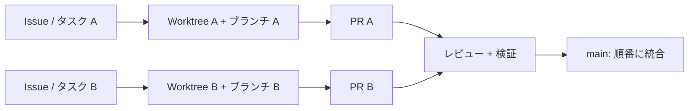

# 並行セッションと worktree

- 状態: 採用済み（Accepted）
- 管理責任者: リポジトリメンテナー
- 最終更新日: 2026-08-15

## 目的

この文書は、人間、Codex のチャット、AI エージェント、サブエージェントが同じリポジトリで並行作業するときの担当範囲と排他を定義します。目的は Git の競合だけでなく、別々の正しい変更が同じ仕様判断を異なる方向へ進める、意味上の競合を防ぐことです。

## 基本原則

**一つの独立した作業セッションは、一つのタスク、一つの専用 worktree、一つの専用ブランチを所有します。** Codex 管理の worktree が最初は分離 HEAD（detached HEAD）の場合、他のセッションと共有せず、そのタスク専用として扱い、コミットやリモート送信の前にタスクブランチを作ります。

ここで「独立セッション」は、別の最上位チャット、別のタスクを所有するエージェントを指します。主セッション内で管理されるサブエージェントは独立セッションではなく、主セッションが重複しないファイル範囲を割り当てた場合だけ、共有 worktree へ書き込めます。これを唯一の例外とし、主セッションが一つの作業セッションとして全差分に責任を持ちます。

- 同じ worktree で複数セッションを同時に書き込み可能にしない
- 同じブランチを複数の worktree へチェックアウトしない
- 同じファイル範囲を複数の作業セッションが同時に所有しない
- ローカルのチェックアウトは一つの前面作業セッションだけが使い、追加セッションは worktree を使う
- 常設 worktree で複数のチャットを開始できても、同時に書き込むセッションは一つだけにする



## 動的情報の正本

- タスクの目的、受け入れ条件、人間の責任者、状態: GitHub Issue
- セッションの担当範囲、ブランチ、予定変更範囲: Issue のコメントまたは下書き PR
- 差分、検証、レビュー: 下書き PR / PR
- 共有する途中状態: リモートのタスクブランチにあるコミット
- 長期優先順位: ロードマップ

ローカルパス、Codex のチャット、worktree の存在、stash、未コミット差分は、他の環境から確認できないため共有状態の正本にしません。GitHub を利用できない、または書き込み権限がない状態で、利用者が明示したローカルタスクだけは、現在の利用者タスクを暫定記録にできます。同一利用者が管理する現在のタスクの一対一の継続・引き継ぎだけは許可し、それ以外の独立タスクとの共有前に、着手可能（`Ready`）な Issue へ同期します。

## 担当範囲の宣言

作業セッションは変更前に、着手可能（`Ready`）な Issue へ次を記録します。下書き PR は担当範囲を参照し、差分と検証を可視化します。

```md
状態: 作業中（In progress）
タスク責任者: @human-owner
作業セッション: <人の名前またはセッションの識別名>
ブランチ: <type/issue-id-description>
Worktree: ローカル / Codex 管理 / 常設 / その他
予定する変更範囲:
- path/or/directory
依存関係:
- #123
引き継ぎまたはレビューの予定地点: <作成した期限ではなく、到達条件>
```

worktree のパス、端末名、認証情報は記録しません。Issue の担当者（Assignee）は人間の責任者を示し、AI セッション名で置き換えません。

有効な担当範囲の宣言には、着手可能なタスク、タスク責任者、ブランチまたはタスク用の分離 worktree、変更予定範囲が必要です。同時宣言や範囲の重複がある場合は書き込みを始めず、メンテナーまたは統合担当が分割か順序を決めます。

## 作業セッションの開始

1. 着手可能な Issue、関連する担当範囲の宣言、受け入れ条件を確認する
2. ネットワークと権限がある場合は `origin/main` を取得し、最新コミットを基点にする
3. `git status --short --branch` と `git worktree list` で現在状態を確認する
4. 新しい専用 worktree を作る、または Codex の **Worktree** モードでチャットを開始する
5. `type/issue-id-short-description` の専用ブランチを使用する。Codex 管理の分離 HEAD では、公開前に **Create branch here** などでブランチを作る
6. Issue へ担当範囲と変更予定範囲を記録し、意味のある差分ができたら下書き PR から関連付ける
7. 重複がないことを再確認してから変更する

リモート取得、Issue、PR を確認できない、または書き込み権限がない場合は、その制約を明示し、利用者から割り当てられた重複しないローカル範囲だけを暫定タスクとして変更します。同一利用者が管理する一対一の継続・引き継ぎを除き、独立タスクとの共有、リモート送信、PR、リポジトリ単位の引き継ぎ前に、利用者または権限を持つ人が着手可能（`Ready`）な Issue を作成・更新します。

## ブランチと対象範囲の規則

- 並行タスクのブランチは Issue 番号を必須にする。例: `feat/123-add-log-reader`
- 一つのブランチを複数の作業セッションが交互に使う場合は、同時利用せず引き継ぎを成立させる
- 対象範囲が拡大する前に、担当範囲の宣言と PR 本文を更新し、重複を再確認する
- ロックファイル、共通設定、スキーマ、移行、用語集、公開契約、リポジトリ規則は競合しやすい横断ファイルとし、同時編集せず統合担当を一人にする
- 生成ファイルと生成元を別セッションに分けない。生成元の担当者が生成・検証まで担当する
- 一方のタスクが他方の未マージ変更へ依存する場合、基点、積み重ね方、マージ順を Issue で合意する

ファイルの担当範囲は調整のための規則であり、セキュリティ境界ではありません。別セッションの変更が見える場合も、権限があるとは解釈しません。

## 一つのセッション内のサブエージェント

サブエージェントは主セッションのタスクと権限の内側で動き、独立したタスク責任者にはなりません。

- 読み取り専用の調査は並行実行できる
- 書き込みを委譲する場合は、主セッションが重複しないファイル範囲を一意に割り当てる
- 同じファイル、ロックファイル、共通スキーマ、近接行を複数のサブエージェントに編集させない
- サブエージェントはブランチや worktree の操作、コミット、リモート送信、PR、外部への書き込みを行わない
- 重複または未知の変更を見つけたら編集を止め、主セッションへ返す
- 主セッションが差分全体、統合、最終検証、完了判断を担当する

詳細な委譲の規則は、ルートの [`AGENTS.md`](../../AGENTS.md) を参照します。

## 競合時の手順

別セッションと変更範囲または仕様判断が衝突した場合:

1. 両セッションとも、重複する範囲への書き込みを停止する
2. 両方のブランチと worktree の差分を保持し、リセット、復元、強制送信しない
3. Issue または PR に、重複範囲、各変更の意図、現在のコミット、検証状態を記録する
4. メンテナーまたは統合担当が、担当者、マージ順、範囲の分割、代替方針を決める
5. 後順のブランチが先行マージ後の `main` を取り込み、意味上の競合を解消する
6. 競合解消後に影響範囲を再検証し、意味のある差分が変わった場合は再レビューする

競合マーカーが消えたことだけを解消の証拠にしません。双方の受け入れ条件と正本文書を満たすことを確認します。

## 中断と引き継ぎ

セッションを止める、別セッションへ移す、担当者を変更する場合は、原則として[引き継ぎテンプレート](templates/handoff.md)を Issue / PR のコメントに記載します。許可されたローカル作業の一対一の継続・引き継ぎでは、現在の Codex タスクまたは利用者管理のタスク記録に記載します。

- コミットやリモート送信が許可されている場合は、作業途中の内容を一貫したコミットとしてリモートのタスクブランチに保存する
- 許可されていない AI セッションは勝手にコミットやリモート送信をせず、ローカルだけにある差分と保存が必要なことを報告する
- 引き継ぎには、ブランチ、最新コミット、変更済み・予約中のファイル、検証、未実施項目、リスク、停止要因、次の一操作を含める
- 記録済みのリモートブランチとコミットから取得できない状態は、秘密情報を含まないタスク、スナップショット（snapshot）、worktree の識別名と「現在復元可能（`Recoverable now`）」を記録する。未コミット差分、未送信のコミット、スナップショットだけにある変更を含み、復元場所がない状態では引き継ぎは成立しない
- 前の担当者が引き継ぎを提示し、後任が Issue / PR で明示的に受諾した時点で担当が移る。Issue / PR のないローカルタスクでは、利用者の明示的な再割り当てと現在のタスクの引き継ぎ受領を成立記録とする
- 引き継ぎ待ちの間、第三のセッションは同じ範囲を取得しない

Codex アプリの **Handoff** 機能でローカル（Local）と worktree を移動する場合も、原則として Issue または PR の担当記録を更新します。許可されたローカル作業の一対一の継続・引き継ぎでは、現在の Codex タスクまたは利用者管理のタスク記録を更新します。チャットを移動しただけで担当者が変わったとは扱いません。

## 統合する順序

- `main` への統合は PR 単位で直列化する
- 互いに独立な PR でも、最初のマージ後に次の PR の競合と検査を確認する
- 横断ファイルの変更は統合担当の PR、または最後にマージする専用 PR へ集約する
- 共有ブランチを無断でリベース、強制送信しない。自分だけの未共有ブランチでは[開発ワークフロー](workflow.md)に従ってリベースできる
- 一部だけの作業に `Closes` を使わず `Refs` とし、残るタスクを閉じない

## 後片付け

マージとマージ後の検査が完了した担当者は:

1. Issue または PR の状態と残るタスクを更新する
2. リモートのタスクブランチを削除する
3. 自分の worktree がクリーンで、必要なコミットがリモートへ送信済み、またはマージ済みであることを確認する
4. Codex 管理の worktree は関連チャットをアーカイブするか、アプリの後片付けに任せる
5. 常設または手動作成した worktree は、自分のものだけを安全確認後に解放する

別セッションの worktree、ブランチ、プロセスを後片付けしません。worktree を先に削除してローカルだけの変更を失わないようにします。

## Git 管理外と端末固有のファイル

管理された worktree は追跡対象ファイルを基に作られるため、Git 管理外の端末固有ファイルが存在しない場合があります。現段階では `.worktreeinclude` で認証情報、`.env`、本番接続設定を複製しません。

将来の環境構築に端末固有ファイルが必要になった場合は、秘密情報を含まないサンプル、生成手順、秘密情報ストアを優先し、`.worktreeinclude` の採用時にはセキュリティレビューと文書更新を行います。

## 禁止事項

- 複数のチャットに同じローカルのチェックアウトを同時編集させる
- 一つの共有ブランチを複数の worktree で使う
- 担当範囲の宣言なしに横断ファイルを変更する
- 他セッションの差分を「不要」と判断して取り消し、整形する
- ローカルの stash やチャットの記録だけで引き継ぐ
- `main` へ競合する PR を同時にマージし、後続の検査を省略する
- 作業中の worktree を一括して後片付けする
