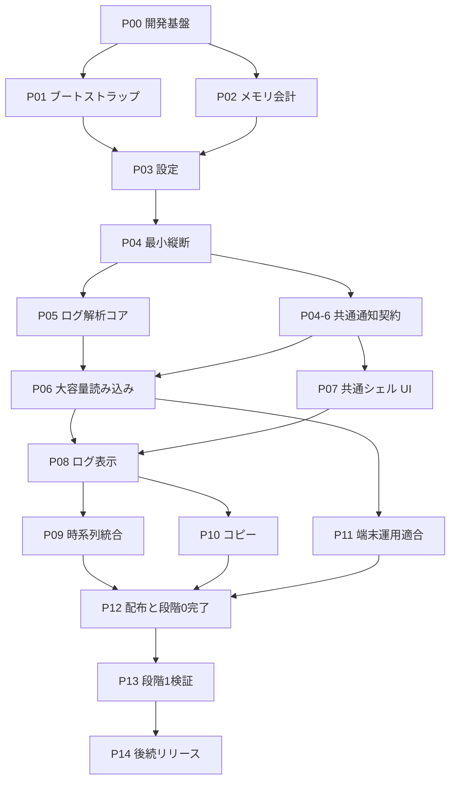

# 実装計画（フェーズ一覧）

- 状態: 草案（Draft）
- 管理責任者: 未定（TBD）
- 最終更新日: 2026-07-30
- 入力資料: Hakutaku 初期仕様 版 1.10（2026-07-29、リポジトリ外の検討資料。利用者が入力として指定）

## この文書群の位置づけ

このディレクトリは、利用者から入力として指定された初期仕様 版 1.10 を、**実装順序へ落とし込んだ作業計画の草案**です。要件の正本ではありません。

**この計画に書かれた要件を、採用済み（`Accepted`）の仕様として扱わないでください。** 理由は次の二点です。

1. 入力資料の版 1.10 は「レビュー反映済み・未決事項なし」と記載されていますが、**リポジトリの外にある文書**です。[`AGENTS.md`](../AGENTS.md) は「チャット履歴、エージェントの記憶、引き継ぎ文だけを現在状態の証拠にしません」と定め、正本はリポジトリ側の文書と Issue / PR に置いています。
2. リポジトリ側の [`docs/product/scope.md`](../docs/product/scope.md)、[`docs/requirements/functional.md`](../docs/requirements/functional.md)、[`docs/architecture/overview.md`](../docs/architecture/overview.md)、[`docs/security/data-handling.md`](../docs/security/data-handling.md)、[`docs/roadmap.md`](../docs/roadmap.md) は、この計画を策定した時点では**すべて草案（Draft）**であり、技術選定、対象範囲、診断ログの方針などに版 1.10 との実質的な差がありました。[`docs/README.md`](../docs/README.md) は「草案（`Draft`）の文は現在の作業仮説です。明示的なレビューまたは ADR なしに、確定仕様として扱わないでください」と定めています。現在は、対象文書をすべて版 1.10 と整合させ、採用済み（`Accepted`）にしています（詳細は下記「実装着手前の前提」）。

この「版 1.10 の内容をリポジトリ正本へ取り込み、採用済みにする」作業は P00 の開始条件であり、実施済みです（下記「実装着手前の前提」）。

| 種類 | 正本 |
| --- | --- |
| 要件・対象範囲・アーキテクチャ | [`docs/`](../docs/README.md) 配下の各文書（現在すべて採用済み） |
| 設計判断 | [`docs/architecture/decisions/`](../docs/architecture/decisions/README.md) |
| タスクの目的、受け入れ条件、担当者、進捗、現在状態 | GitHub Issue / PR |
| 差分と検証結果 | 下書き PR / PR |
| **この文書群** | 上記を前提とした**順序と分割の提案**のみ |

**担当者、進捗、現在状態はこの md へ書きません。** Issue / PR が正本です。この md には実装計画の安定した部分だけを置きます。

### 確定要件と暫定方針の区別

入力資料は内容を「確定事項」「暫定方針」「未決事項」の3区分で管理しています。この計画では、**暫定方針を確定要件の受け入れ条件へ昇格させません。**

- 各フェーズの受け入れ条件表には「根拠」欄があります。`確定要件` は ID 付き要件表に由来するもの、`暫定設計` は入力資料の「暫定方針」に由来するものです
- `暫定設計` の項目は、実装の設計候補および検証項目として扱い、達成できない場合は設計を変更する余地があります。要件違反として扱いません
- 例: 「メモリ予算の 90% をソフトしきい値とする」「行索引は 1 行 24 バイト以下」は入力資料 5.2 の暫定方針であり、要件 ID を持ちません

## 配置についての例外判断

このディレクトリはリポジトリのルートにあります。[`docs/development/repository-operations.md` の「ファイルの配置」](../docs/development/repository-operations.md#ファイルの配置)（採用済み）は、ルートを自動検出・全体適用・法的や配布上の理由で必要なファイルに限り、人が読む一般文書は `docs/` 配下と定めています。**この計画はその規則の例外です。**

- 2026-07-30、利用者へ規則との衝突と `docs/tasks/` へ置く代替案を示し、**ルート `tasks/` のままとする明示的な判断を得ました**
- 「作業記録だから規則の対象外」という理由付けは使いません。規則に対する明示的な例外判断として扱います
- 配置を変更する場合は、[`README.md`](../README.md)、[`docs/README.md`](../docs/README.md)、相対リンクを同じ変更で整合させます

## 実装着手前の前提

次の前提は、P00 の着手前に満たしました（達成済み）。この計画では扱わず、詳細と根拠は [`docs/roadmap.md`](../docs/roadmap.md) の「実装着手前の前提（達成済み）」節を正本とします。

1. **版 1.10 の内容をリポジトリ正本へ取り込んだ。** `docs/product/scope.md`、`docs/requirements/functional.md`、`docs/requirements/quality.md`、`docs/architecture/overview.md`、`docs/security/data-handling.md`、`docs/roadmap.md` を版 1.10 と整合させ、レビューを経て採用済み（`Accepted`）にしました
2. **技術選定を ADR へ記録した。** 版 1.10 の `DEC-002`（Rust＋Tauri の暫定採用）に対応する [ADR-0001](../docs/architecture/decisions/0001-rust-tauri-provisional-adoption.md) を作成しました。状態は暫定決定であり、確定は P13 の完了時です（`VER-001`）
3. **着手可能（`Ready`）な Issue を用意した。** [`docs/development/workflow.md`](../docs/development/workflow.md) が求める、大きな機能や複数領域にまたがる変更の実装前 Issue 合意を満たしました

## 分割の考え方

入力資料の 10.6（`VER-001`〜`VER-007`）が、この計画の最上位の制約です。技術検証を段階0（現行の開発環境）と段階1（Windows 10 IoT Enterprise LTSC 実機）に分け、**段階1の完了までは Rust + Tauri の採用（`DEC-002`）を暫定決定として扱います**。順序は次の三つの原則で決めています。

1. **層をまたぐ契約を最初に固定する。** WebView2 の Fixed Version 経路（`VER-003`）、Rust ↔ WebView 間の転送コスト、連続スクロール時の WebView2 メモリ推移（`PERF-012`）は、確定後の差し替え費用が大きく、成立しなければ GUI フレームワークの再選定につながります。P01・P02・P04 で早期に実測します。
2. **後付けできない仕組みを先に入れる。** メモリ会計は `PERF-010` により「コア設計の一部として初期実装から組み込み、後付けにしない」と定められています。確保経路を一本化する設計は後から入れられないため、大きなバッファを扱う前（P02）に土台を置きます。**`VER-005` が緩和するのは段階0の性能値による合否判定だけで、予約・拒否という機能要件は緩めません。**
3. **段階0で確定してよい範囲を先に固める。** `VER-007` により、ログ解析プロファイル、日時正規化、文字コード判定、時系列マージ、内部表現、設定スキーマは段階0で確定できます。実機を待つ必要がないため、P03〜P10 に集約します。

あわせて、段階1で問題が出た場合に備え、**GUI 層と Rust コア層の境界を全フェーズで維持します**（10.6 の暫定方針、`9.2`）。GUI フレームワークの差し替えが局所的な変更で済む状態を、各フェーズの受け入れ条件に含めています。

### 機能を後回しにするときの条件

原則 1 の裏返しとして、**機能の実装を後のフェーズへ回すときは、層をまたぐ契約だけを先に確定させます。** 契約が後から変わると、確定済みのフェーズへ変更が波及します。

この方針を最も明確に適用しているのが、時系列統合表示（P09）を最小縦断（P04）から外した判断です。マージの実装は P06・P09 へ回す一方で、範囲取得契約は最初から複数ソースを前提とした形で定義します。単一ファイル前提の物理オフセット契約を先に公開すると、複数ソースの全順序、同一時刻の同順位解決、ソース別の来歴を足した際に、範囲指定、項目識別子、仮想スクロールの再取得整合性まで変更が波及します。具体的な契約の要件は [P04 の「契約に織り込む4点」](phase-04-vertical-slice.md#契約に織り込む4点)にまとめています。

同様に、フェーズ間で所有範囲が重なりやすい箇所には**担当境界**を明記しています。

| 担当境界 | 所有の分け方 |
| --- | --- |
| P04 と P08 | P04 が範囲取得契約・保持上限・破棄と再取得の成立を所有。P08 はその契約を変更せず、仮想表示の完成度と連続スクロール検証の水準を上げる |
| P06 と P09 | P06 が複数ソースの登録・各ソース内の安定順序・`source_id` と来歴・世代・独立した走査を所有。P09 がソースをまたぐグローバルな全順序と同一比較キーの同順位解決を所有 |
| P03 と P05 | P03 が設定基盤と共通スキーマ、およびログ解析プロファイルのスキーマの**形**を所有。P05 がプロファイルの**意味検証**（同優先度 glob の重複検出など）を所有 |
| P03 と各消費フェーズ | P03 が「型付きの値として検証し受け渡す」までを所有。設定値を使った**挙動**は各消費フェーズ（P08、P10、P11）が所有 |

## 全フェーズで維持する不変条件

個別フェーズの完了では担保できず、全フェーズで維持する必要があるものです。各フェーズの受け入れ条件にも現れますが、**どこか1つのフェーズで「完了」にはできません**。

| 不変条件 | 要件 | 最終確認 |
| --- | --- | --- |
| 参照データを変更しない（編集機能を持たない） | `PROD-003`、`ERR-003` | 各フェーズのハッシュ・タイムスタンプ確認 |
| **参照内容をネットワークへ送信しない** | `SEC-001` | **P12 のプロセス単位の送信監視。** CSP（`SEC-011`）は WebView2 側しか制限せず、Rust コアと依存クレートの通信は防げないため、P01 では完了しません |
| 高速性を重視する | `TECH-001`、`PROD-008`、`PERF-003` | P12・P13 の計測 |
| GUI 層と Rust コア層の境界を保つ | 10.6、`9.2` | 各フェーズの依存グラフ確認 |
| 実行時の書き込み先を `logs`／`temp`／`WebView2` に限定する | `SEC-009` | P12 のファイルシステム監視。`WebView2Runtime` の ACL 変更は `DIST-010` による明示的な例外 |

依存クレートを追加するたびに、`SEC-001` と `VER-004`（下限環境での動作）の両方を確認します。

## フェーズ一覧

| フェーズ | 表題 | 主な対象要件 | 段階 |
| --- | --- | --- | --- |
| [P00](phase-00-foundation.md) | 開発基盤と層境界 | `VER-004`、`EXT-001`〜`003`、`TECH-004` | 段階0 |
| [P01](phase-01-bootstrap-webview2.md) | 起動ブートストラップと WebView2 経路 | `TECH-005`、`DIST-006`〜`017`、`DIAG-001`〜`007` | 段階0 |
| [P02](phase-02-memory-accounting.md) | メモリ会計とヒープ予算の基盤 | `PERF-008`、`PERF-010`、`TECH-006` | 段階0 |
| [P03](phase-03-configuration.md) | 設定ファイル `hakutaku.yaml` | `CFG-001`〜`024`（後続分を除く） | 段階0 |
| [P04](phase-04-vertical-slice.md) | 最小縦断の貫通と転送契約の実測 | `PERF-012`、`PERF-013`、`CFG-022` | 段階0 |
| [P05](phase-05-log-parsing-core.md) | ログ解析コア（書式・プロファイル・文字コード） | `LOG-002`〜`014`、`LOG-021`〜`025`、`ENC-001`〜`007` | 段階0 |
| [P06](phase-06-large-file-loading.md) | 大容量読み込み、索引、キャンセル、変更検知 | `PERF-001`〜`007`、`LOG-023`、`LOG-026`〜`028` | 段階0 |
| [P07](phase-07-shell-ui.md) | 共通シェル UI とアドホックなファイル選択 | `PROD-005`、`PROD-016`、`ERR-001`〜`002` | 段階0 |
| [P08](phase-08-log-view.md) | ログ表示と仮想スクロール、保持上限の運用 | `PERF-012`、`LOG-001`、`LOG-015` | 段階0 |
| [P09](phase-09-timeline-merge.md) | 時系列統合表示 | `LOG-006`〜`008`、`LOG-015`、`LOG-024`〜`025` | 段階0 |
| [P10](phase-10-clipboard-copy.md) | 選択とクリップボードコピー | `COPY-001`〜`006`、`CFG-018` | 段階0 |
| [P11](phase-11-device-operation.md) | 対象端末での運用適合（昇格・資源抑制・安全な停止） | `PRIV-001`〜`004`、`PERF-014`、`PERF-016` | 段階0 |
| [P12](phase-12-distribution-stage0.md) | 配布・検証フェーズ（配布物と段階0検証の完了判定） | `DIST-001`〜`005`、`VER-002`〜`005`、`SEC-001` | 段階0 |
| [P13](phase-13-stage1-ltsc.md) | 段階1検証（LTSC 実機）と技術選定の確定 | `VER-006`、`PERF-015`、`ENV-001` | 段階1 |
| [P14](phase-14-post-initial-release.md) | 初期リリース後の拡張（後続バックログ） | `DB-*`、`DCM-*`、`LOG-017`〜`019` | 後続 |

初期リリースの範囲は P00〜P13 です。P14 は初期リリースに含めません（`PROD-009`、12.1 の除外規則）。

## Issue とブランチへの対応

**1 フェーズ = 1 Issue = 1 ブランチにはしません。** フェーズは大きすぎるため、次の三層で運用します。

| 層 | 対応 | 内容 |
| --- | --- | --- |
| 全体 | 起点 Issue | 初期リリース P00〜P13 の入口。現在どのフェーズまで完了したかを読む場所 |
| フェーズ | 親 Issue | 目的、完了ゲート、対象要件の集約 |
| 実装単位 | 子 Issue = 1 ブランチ = 1 PR | 各フェーズ md の「実装単位（子 Issue 候補）」節に列挙 |

層の紐付けは **GitHub のサブ Issue 機能**で行い、親 Issue の本文へ手書きの一覧表を作りません。手書きの表は子を追加するたびに親本文の編集が必要になり、実態とずれます。サブ Issue 欄の集計を進捗の表示に使います。

- 子 Issue は `gh issue create --parent <親の番号>` で作る。既存の Issue は `gh issue edit <親の番号> --add-sub-issue <子の番号>` で紐付ける
- 起点 Issue は初期リリースの完了まで開いたままにする。フェーズ Issue が全て閉じてもオープンな Issue が残るため、「全フェーズ完了」と「まだ Issue を作っていない」を区別できる
- フェーズ Issue は着手時に作る。[リポジトリ運用規則](../docs/development/repository-operations.md#タスク記録)のとおり Issue の作成は着手承認を意味しないため、未着手のフェーズ Issue を先に並べない
- **サブ Issue が全て閉じたことを完了の証拠にしない。** 完了判定は各フェーズ md の受け入れ条件と完了ゲートによる
- サブ Issue はフェーズ間の依存を表現しない。開始条件は各フェーズ Issue の本文に記載し、必要に応じて `blocked-by` を併用する

P13 は実装ではなく**検証ゲート**です。P12 は配布物と検証用ツールの実装を含むため、実装と検証シナリオの両方を持ちます。どちらもシナリオ別の子 Issue に分け、結果を親ゲートへ集約します。P14 は後続バックログの親項目に留め、SQLite・DICOM・検索・ドラッグ＆ドロップ・索引キャッシュを同一 Issue やブランチにまとめません。

## 各フェーズ md の構成

全フェーズが同じ見出しを持ちます。

| 節 | 内容 |
| --- | --- |
| 冒頭のメタデータ | 状態、開始条件、段階、期待成果物、予定変更範囲 |
| 目的 | このフェーズを置く理由。入力資料のどの制約に対応するか |
| 対象要件 | 要件 ID と要求の要旨 |
| 作業項目 | 実施内容 |
| 実装単位（子 Issue 候補） | 1 ブランチ = 1 PR に収まる単位への分割 |
| 受け入れ条件 | 観測可能な条件、証拠、段階、根拠（`確定要件` または `暫定設計`） |
| 対象外 | このフェーズで扱わないものと、扱うフェーズ |
| 影響 | セキュリティ、データ、性能、互換性への影響 |
| リスクと未決事項 | 確定要件に起因 / 暫定設計に起因 / 人間判断待ち の3分欄 |
| 完了ゲート | 次のフェーズへ進む条件 |
| 後続 Issue / ADR 候補 | このフェーズで発生し得る別タスク |

**P14 だけはこの構成に従いません。** P14 は実装フェーズではなく後続バックログの親項目であり、初期リリースに含めない要件を漏れなく記録することだけを目的としています。作業項目、実装単位、受け入れ条件、完了ゲートは、各項目に着手する時点で個別に作ります。

## 依存関係

P04 が最初の合流点です。ここまでで「起動 → 設定読み込み → 1 ファイルの解析 → 仮想スクロール表示 → コピー」が細い経路で通り、以降のフェーズは各層を深掘りする形になります。

### 開始依存と完了依存を分ける

依存関係図の矢印は**開始依存**です。「並行できる」と言えるかは、開始依存と完了依存を分けて考える必要があります。

| フェーズ | 開始依存 | 完了依存 |
| --- | --- | --- |
| **P04-6**（子 Issue） | P04 の完了ゲート | P04-6 単独 |
| P05 | P04 の完了ゲート | P05 単独 |
| P06 | P04 の完了ゲート、**P04-6**、**P05 の完了**（解析コアを使うため） | P06 単独 |
| P07 | P04 の完了ゲートと **P04-6**。**P06 の完成は不要** | **P06 との結合後**（進捗とキャンセルの動作確認） |

読み方は次のとおりです。

- **P05 と P04-6 は並行できます。** どちらも P04 の完了だけを開始条件にします
- **P06 は P05 と P04-6 の両方の完了後**に開始します。解析コアと通知契約の両方を使うためです
- **P07 は P04-6 の完了後に、疑似データ（fixture）で開始できます。** P05 と P06 を待ちません。ただし完了は P06 との結合後です

したがって、**P05 と P06 は順次**です。**並行できるのは「P07」と「P05 → P06 の系列」**です。

これを成立させるため、進捗・エラー・キャンセルの共通契約を **P04-6 として P04 の完了直後に着手できる独立した子 Issue へ切り出しています**。この契約がないと、P07 は P06 の完成を待つことになります。

## 段階0と段階1の切り分け

| 項目 | 段階0（開発環境） | 段階1（LTSC 実機） |
| --- | --- | --- |
| 対象フェーズ | P00〜P12 | P13 |
| 起動経路 | Evergreen と Fixed Version の両方（`VER-003`、`DIST-017` で強制） | Evergreen 未導入機種での実起動（`DIST-006`〜`014`） |
| 性能値 | 参考値のみ。計測手段が機能することの確認まで（`VER-005`） | 合否判定の基準（`PERF-015`） |
| 書き込み中ログ | 追記を行うテスト用プロセスで代替検証（10.6） | 他の業務ソフトウェア稼働中の実測（`LOG-027`） |
| OS 下限 | build 17763 相当を下限としてビルド構成（`VER-004`） | 最古機種のビルド番号を実測し `ENV-001` を確定 |
| `DEC-002` | 暫定決定を維持（`VER-001`） | 完了をもって確定 |

**段階0の完了で技術選定を確定しません。** P12 の完了ゲートは「段階1で確認すべき事項が LTSC 固有の要因だけに絞り込めていること」です。

`VER-005` が段階0で緩和するのは**性能値による合否判定**だけです。予約・拒否（`PERF-010`）、保持上限と破棄・再取得（`PERF-012`）といった機能要件は、段階0でも完全に満たす必要があります。

## 要件 ID の割り当て

入力資料の確定要件 ID は 213 件です。全件をいずれかのフェーズ、または明示的な対象外へ割り当てています。対応表は [`requirement-coverage.md`](requirement-coverage.md) を参照してください。

## この計画を更新するとき

- 入力資料の要件が変わった場合は、リポジトリ正本を先に更新し、対応するフェーズの対象要件と受け入れ条件を追従させる
- フェーズの順序や分割を変える場合は、この索引の一覧・依存関係図・[`requirement-coverage.md`](requirement-coverage.md) を同じ変更で整合させる
- 実装中に判明した未決事項は、フェーズ md の「リスクと未決事項」へ記録し、設計判断に至ったものは ADR へ移す
- 担当者、進捗、現在状態を md へ書かない。Issue / PR が正本

## 変更履歴

- 2026-07-30: 初期仕様 版 1.10 からフェーズ分割を作成。Codex のレビュー指摘により、正本の位置づけ、確定要件と暫定方針の区別、配置の例外判断の記録、Issue の二層運用を追加
- 2026-07-30: Codex の全文レビュー指摘を反映。P02 に実確保と予約の会計関係を定義、P03 の受け入れ条件を後続実装へ依存しない形へ修正、P06 と P09 のマージ責務を一意化、開始依存と完了依存の分離（P04-6 の切り出し）、P12 の `VER-005` によるゲートと参考値の切り分け、P01 の ACL 例外の明記、`SEC-001` を全フェーズの不変条件へ、否定要件の不在確認を P12 へ追加
- 2026-07-30: Issue の運用を二層から三層へ変更。起点 Issue を追加し、層の紐付けを GitHub のサブ Issue 機能に統一。フェーズの対応から「マイルストーン」を外し、親 Issue 本文への手書き一覧表を禁止
